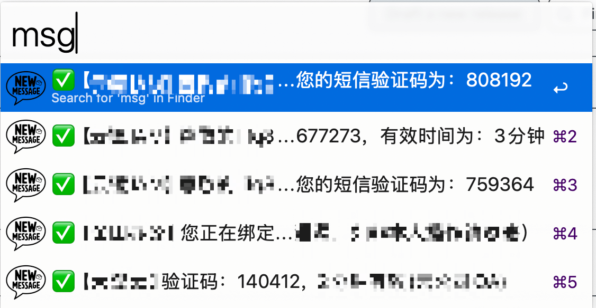

# Alfred-iMessage-Reader

This Alfred Workflow, MacOS X Message Reader, enables you to read iMessage messages and extract corresponding verification codes. It is especially useful for scenarios requiring frequent access to verification codes, allowing you to quickly retrieve them without manually searching through messages.

## Installation

1. Download the latest release from the [Releases page](https://github.com/iFurySt/Alfred-iMessage-Reader/releases).
2. Double-click the downloaded file to install the workflow in Alfred.

## Usage
1. Open Alfred and type `msg` to trigger the workflow.
2. Select the message you want to read and press `Enter` to copy the message content to the clipboard.

Screenshot:

## License

This project is licensed under the MIT License - see the [LICENSE](LICENSE) file for details.
